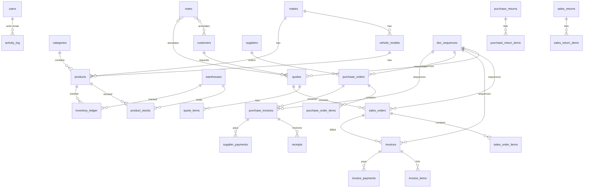
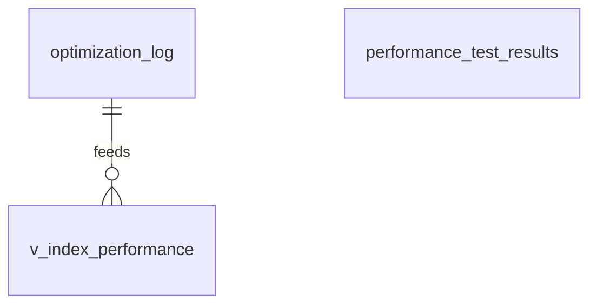

# Technical Reference

## Executive Summary

- Purpose: Spare parts sales, purchasing, inventory, and billing system with quotes, orders, invoices, returns, stock movements, payments, notes, and reporting.
- Key features: Product/master data management, quotes→orders→invoices flow, AP/AR payments, inventory ledger, multi‑warehouse stocks, receipts (GRN), stock transfers/adjustments, audit activity log, Arabic/English UI strings, Redis‑backed sessions and caching, request/error/database performance logging.
- Audiences: Developers, DBAs, ops/SRE, QA, security auditors, support.
- Business goals: Accurate inventory and financial tracking, fast product/search, reliable documents/numbering, low‑friction operations, secure multi‑user access.

## Architecture Overview

```mermaid
flowchart LR
  subgraph Client
    Browser[Browser]
  end

  subgraph Server[PHP App]
    Router[Router]
    Controllers[Controllers]
    Models[Models]
    Views[Views]
    Logger[Logger]
    Validator[Validator]
    Sessions[SessionManager]
  end

  DB[(MySQL / MariaDB)]
  Cache[(Redis)]
  Logs[(storage/logs)]

  Browser -->|HTTP(S)| Router
  Router --> Controllers --> Models --> DB
  Controllers --> Views
  Sessions --> Cache
  Logger --> Logs
```

### Tech Stack

- Languages: PHP 8+ (procedural + lightweight MVC), SQL (MySQL 8.x / MariaDB), JS/CSS (vanilla)
- Frameworks: Custom micro MVC (no Composer)
- Caching/Sessions: Redis (configurable; fallback to file sessions)
- CI: GitHub Actions workflow for code dump (`.github/workflows/code-dump.yml`)
- Frontend: Server-rendered views in `app/views`, progressive enhancements via `public/assets/js`

## Environment & Configuration

### Runtime Requirements

- PHP: 8.1+ recommended with PDO MySQL, JSON, mbstring, openssl
- MySQL/MariaDB: Server version 8.0.37‑29 (per live dump)
- Redis: optional but recommended for sessions/caching
- Web server: Any PHP‑capable (Apache/Nginx/IIS); sample `web.config` present

### Environment Variables

- `APP_ENV`: default `production` — Environment name
- `APP_DEBUG`: default `false` — Enables verbose error display; sensitive
- `APP_URL`: default `/` — Base URL for URL generation
- `APP_TIMEZONE`: default `UTC` — PHP timezone
- `DB_HOST`: default `127.0.0.1` — Database host; sensitive
- `DB_PORT`: default `3306` — Database port
- `DB_NAME`: default required — Database name; sensitive
- `DB_USER`: default required — Database user; sensitive
- `DB_PASS`: default required — Database password; sensitive

Redis/session (supported, read from `config/redis.php` and `Env`):

- `REDIS_HOST`, `REDIS_PORT`, `REDIS_PASSWORD` (sensitive), `REDIS_DATABASE`, `REDIS_PREFIX`, `REDIS_SSL_*`
- `REDIS_TTL_*` (per‑type TTLs), `REDIS_MONITORING_*`, `REDIS_MAX_RETRIES`, etc.
- Session: `SESSION_DRIVER` (default `redis`), `SESSION_LIFETIME`, `SESSION_COOKIE`, `SESSION_SECURE`, `SESSION_HTTP_ONLY`, `SESSION_SAME_SITE`, `SESSION_DOMAIN`, `SESSION_ENCRYPT`

### Secrets Handling

- Secrets are supplied via `config/.env` (parsed by `app/core/env.php`).
- Keep `APP_DEBUG=false` in production; restrict access to `config/.env`.
- Database and Redis credentials are sensitive and should be injected via environment at deploy time.

## Database (Current vs Target)

Source of truth (live): `chatgpt2_mi_2025-09-03_14-27-44.sql`
Pending/desired changes: SQL files in `scripts/*.sql`

### Current ERD (Live Dump)



### Target ERD (After Applying Pending Migrations)

Additions targeted by scripts:

- New tables: `optimization_log`, `performance_test_results` (monitoring/benchmarking)
- Views: `v_index_performance`, `v_table_performance`
- Procedures: `OptimizeApplicationIndexes`, plus security procedures in security script
- Additional indexes across many tables (details below)

Conflicts to resolve before applying:

- `scripts/additional_database_indexes.sql` references non‑existent `invoice_lines` and `invoice_payments.payment_date` in live schema. Live uses `invoice_items` and `invoice_payments.paid_at`. Adjust scripts or plan renames accordingly.
- `scripts/database_security_setup.sql` targets database `spare_parts_db` and creates audit tables `database_audit_log`, `security_audit_log`. Align DB name with `DB_NAME=chatgpt2_mi` or parameterize.



### Schema Tables (Current)

Key tables with columns, constraints, and notable indexes:

- activity_log: id PK; actor(varchar191) not null; action(varchar64); entity_type(varchar64); entity_id(uint); meta(text); created_at(ts default now). Indexes: idx_entity(entity_type,entity_id), idx_action(action).
- categories: id PK; parent_id(uint) FK->categories.id; name; slug UNIQUE; created_at, updated_at. Index: idx_categories_parent.
- cogs_entries: id PK; invoice_id uint; product_id uint; warehouse_id uint; qty int; unit_cost dec(12,4); line_cost dec(14,4); created_at. Indexes on invoice_id, product_id, warehouse_id.
- customers: id PK; name; phone; email; address; created_at, updated_at.
- doc_sequences: PK(prefix,y); last_no int.
- inventory_ledger: id PK; product_id uint; warehouse_id uint; doc_type enum; doc_id uint; qty_delta int; unit_cost dec(12,4); value_delta dec(14,4); created_at. Indexes: product_id, warehouse_id, doc_type, doc_id.
- invoice_items: id PK; invoice_id uint FK->invoices.id (CASCADE); product_id uint; warehouse_id uint; qty uint; price dec(12,2); line_total dec(12,2). Index: idx_invoice_items_invoice.
- invoice_payments: id PK; invoice_id uint FK->invoices.id (CASCADE); paid_at datetime; method; reference; amount dec(12,2); note; created_at. Index: idx_payments_invoice.
- invoices: id PK; inv_no UNIQUE; sales_order_id uint; customer_id uint; tax_rate dec(5,2) dflt 0; subtotal dec; tax_amount dec; total dec; paid_amount dec; status enum('unpaid','partial','paid','void') dflt 'unpaid'; created_at, updated_at; cogs_total dec.
- makes: id PK; name; slug UNIQUE; created_at, updated_at.
- notes: id PK; entity_type enum('quote','sales_order','sales_invoice','purchase_order','purchase_invoice','customer','category','warehouse','product'); entity_id uint; is_public bool dflt 0; body text; created_by varchar191; created_by_id int; created_at; Index: idx_entity(entity_type,entity_id,created_at).
- product_stocks: PK(product_id,warehouse_id); qty_on_hand uint dflt 0; qty_reserved uint dflt 0; avg_cost dec(12,4) dflt 0; FKs: product_id->products.id CASCADE; warehouse_id->warehouses.id RESTRICT. Duplicated unique keys ux_product_warehouse, uq_prod_wh also on (product_id,warehouse_id).
- products: id PK; code UNIQUE; name; category_id uint FK->categories.id SET NULL; make_id uint FK->makes.id SET NULL; model_id uint FK->vehicle_models.id SET NULL; cost dec; price dec; created_at, updated_at. Indexes on category_id, make_id, model_id.
- purchase_invoices: id PK; pi_no UNIQUE; purchase_order_id uint; supplier_id uint; subtotal dec; tax_rate dec; tax_amount dec; total dec; created_at; paid_amount dec; status enum('unpaid','partial','paid'); Indexes: idx_pi_po, idx_pi_supplier.
- purchase_order_items: id PK; purchase_order_id uint; product_id uint; warehouse_id uint; qty uint; received_qty dec(14,4) dflt 0; price dec; line_total dec. Indexes on purchase_order_id, product_id, warehouse_id.
- purchase_orders: id PK; po_no UNIQUE; supplier_id uint; status enum('draft','ordered','received','closed') dflt 'draft'; tax_rate dec; subtotal dec; tax_amount dec; total dec; created_at.
- purchase_return_items: id PK; purchase_return_id uint; product_id uint; warehouse_id uint; qty uint; price dec; line_total dec. Indexes on purchase_return_id, product_id, warehouse_id.
- purchase_returns: id PK; pr_no UNIQUE; purchase_invoice_id uint; supplier_id uint; subtotal dec; tax_rate dec; tax_amount dec; total dec; created_at. Indexes: idx_pr_pi, idx_pr_sup.
- quote_items: id PK; quote_id uint FK->quotes.id CASCADE; product_id uint FK->products.id RESTRICT; warehouse_id uint FK->warehouses.id RESTRICT; qty uint; price dec; line_total dec. Indexes on quote_id, product_id, warehouse_id.
- quotes: id PK; quote_no UNIQUE; customer_id uint FK->customers.id RESTRICT; status varchar(20) dflt 'draft'; tax_rate dec; subtotal dec; tax_amount dec; total dec; expires_at date; created_at, updated_at. Index idx_quotes_customer.
- receipts: id PK; purchase_invoice_id uint; product_id uint; warehouse_id uint; qty uint; price dec; created_at. Indexes: idx_receipts_pi, idx_receipts_product, idx_receipts_wh.
- sales_order_items: id PK; sales_order_id uint FK->sales_orders.id CASCADE; product_id uint; warehouse_id uint; qty uint; price dec; line_total dec. Index: idx_soi_so.
- sales_orders: id PK; so_no UNIQUE; quote_id uint FK->quotes.id RESTRICT; customer_id uint; status enum('open','closed','cancelled') dflt 'open'; tax_rate dec; subtotal dec; tax_amount dec; total dec; created_at, updated_at. Index: idx_so_quote.
- sales_return_items: id PK; sales_return_id uint; product_id uint; warehouse_id uint; qty uint; price dec; line_total dec. Indexes: idx_sri_sr, idx_sri_product, idx_sri_warehouse.
- sales_returns: id PK; sr_no UNIQUE; sales_invoice_id uint; client_id uint; subtotal dec; tax_rate dec; tax_amount dec; total dec; created_at. Indexes: idx_sr_invoice, idx_sr_client.
- stock_adjustment_items: id PK; stock_adjustment_id uint; product_id uint; qty_change int; created_at. Indexes: stock_adjustment_id, product_id.
- stock_adjustments: id PK; adj_no UNIQUE; warehouse_id uint; reason enum('count','damage','shrink','other') dflt 'count'; note text; created_at.
- stock_transfer_items: id PK; stock_transfer_id uint; product_id uint; qty uint; created_at. Indexes: stock_transfer_id, product_id.
- stock_transfers: id PK; tr_no UNIQUE; from_warehouse_id uint; to_warehouse_id uint; note text; created_at.
- supplier_payments: id PK; supplier_id uint; purchase_invoice_id uint; paid_at datetime; method; reference; amount dec; note text; created_at. Indexes: idx_sp_supplier, idx_sp_pi, idx_sp_paid_at.
- suppliers: id PK; name; phone; email; address.
- users: id PK; email UNIQUE; password_hash; role dflt 'admin'; created_at.

Notable FK gaps in live schema:

- Many logical relationships lack declared FKs (e.g., invoices.customer_id, purchase_* foreign keys). Application likely enforces integrity at code level.

### Pending Migrations — Intended Changes

- `scripts/database_index_optimization.sql`
  - Create indexes: `products(category_id,make_id,model_id)`, `invoices(customer_id,created_at,status)`, `product_stocks(warehouse_id,qty_on_hand)`, `inventory_ledger(product_id,created_at)`, `purchase_invoices(supplier_id,created_at,status)`, `activity_log(entity_type,entity_id,action,created_at)`, `cogs_entries(invoice_id,product_id,created_at)`
- `scripts/additional_database_indexes.sql`
  - Intended: composite indexes for invoice line/payment analytics; search indexes on customers(name,email), products(name,code); conditional FULLTEXT on products(name) if `description` missing; procedures/views: `OptimizeApplicationIndexes`, views `v_index_performance`, `v_table_performance`; table `optimization_log`
  - Conflicts: references `invoice_lines` (not present; live uses `invoice_items`), and `invoice_payments.payment_date` (live uses `paid_at`). Must be reconciled.
- `scripts/performance_testing.sql`
  - Adds: `performance_test_results` table for benchmark logging.
- `scripts/database_security_setup.sql`
  - Adds users/privileges; requires DB name alignment. Creates audit tables `database_audit_log`, `security_audit_log`, maintenance procedures.

### Delta Summary

- Index strategy: Adds several high‑value composite indexes aligning with code hints in `app/models/product.php` and reporting queries.
- New objects: `optimization_log`, `performance_test_results`, 2 views, 2+ procedures, 2 audit tables (if security script adapted to current DB).
- Naming conflicts: `invoice_lines` vs `invoice_items`; `payment_date` vs `paid_at`.
- Redundant unique keys on `product_stocks` should be de‑duplicated (currently three unique keys on same columns).

### Data Migration Concerns

- If renaming `invoice_items`→`invoice_lines` or `paid_at`→`payment_date` is desired, plan online renames with views/compatibility or dual‑write; update all code, indexes, and FKs.
- Adding FKs retroactively can fail if orphaned rows exist; pre‑check and clean, then add with `NOT VALID`/`ENFORCED` analogs (MySQL: add with `SET FOREIGN_KEY_CHECKS=0` only temporarily and backfill).
- Backfills: None required for new indexes, but index build time may lock; schedule off‑peak and consider `ALGORITHM=INPLACE, LOCK=NONE` where supported.
- Audit and monitoring tables add write paths; ensure storage and rotation procedures (`CleanOldAuditLogs`) are enabled.

## Modules & APIs

Routing in `public/index.php` via custom `Router`. Typical pattern: `METHOD /path -> Controller@action`. Authentication: Most routes expect active session; CSRF required for POST.

- Auth: GET `/login` (form), POST `/login`, POST `/logout`
- CSRF refresh: GET `/csrf-refresh` returns JSON `{ token }`
- Home/Health: GET `/`, GET `/health`
- Categories: GET `/categories`, GET `/categories/create`, POST `/categories`, GET `/categories/edit`, POST `/categories/update`, POST `/categories/delete`
- Makes/Models/Warehouses: CRUD as above; warehouse details, CSV export
- Products: list/create/edit/delete; stock view/update; search and low‑stock via `Product` model
- Customers: CRUD, `/customers/show`, `/customers/statement`
- Quotes: list/create/store/show; POST `/quotes/{cancel|markexpired|createorder|marksent}`; print
- Orders: list/show/print
- Notes: POST create/update/delete; tied to entities via `notes` table
- Invoices: list/show/print; POST `/invoices/create-from-order`, `/invoices/addpayment`, `/invoices/deletepayment`
- Payments: GET/POST `/payments`, delete
- Suppliers: CRUD, show/statement
- Purchase Orders/Invoices: full flow, receive `/receipts`, delete receipt, print GRN
- Supplier Payments (AP): list/create/delete
- Returns: sales and purchase returns create/print
- Reports: `/reports/{ap-aging|ar-aging|inventory-valuation}`
- Transfers/Adjustments: stock transfer and adjustment flows with printables

Tables touched by major controllers/models:

- Product(s): `products`, `product_stocks`, `categories`, `makes`, `vehicle_models`, `warehouses`
- Quotes/Orders/Invoices: `quotes`, `quote_items`, `sales_orders`, `sales_order_items`, `invoices`, `invoice_items`, `invoice_payments`
- AP: `purchase_orders`, `purchase_order_items`, `purchase_invoices`, `receipts`, `supplier_payments`
- Returns: `sales_returns`, `sales_return_items`, `purchase_returns`, `purchase_return_items`
- Inventory: `inventory_ledger`, `product_stocks`, `stock_transfers`, `stock_transfer_items`, `stock_adjustments`, `stock_adjustment_items`
- Others: `customers`, `suppliers`, `notes`, `activity_log`, `doc_sequences`, `users`

## Security & Compliance

- Input validation: Centralized `App/Core/Validator.php`; controllers validate and sanitize inputs; `format_note_html` escapes + linkifies.
- Output encoding: Views use `htmlspecialchars` where appropriate; helper provides safe note rendering.
- CSRF: Token generated in session; verified on POST or `X-CSRF-TOKEN` header; `/csrf-refresh` endpoint to rotate token.
- AuthN/Z: Session‑based login; roles present in `users.role` but no granular RBAC middleware observed; enhance for per‑route authorization.
- CORS: Not applicable for server‑side rendering; no explicit CORS headers.
- Sensitive data: `.env` file (must be protected). Logs include request/db timings; avoid PII in logs.
- Dependency audits: No Composer/Node dependencies; focus on PHP and server packages.
- Security SQL script proposes hardening, SSL‑required users, audit tables; must be adapted to `DB_NAME` and vetted before prod.

## Testing & QA

- Tests: PHP tests under `tests/` for security (CSRF/controller), performance (queries, frontend), Redis/session, validator and logger unit tests.
- How to run: Execute tests manually in PHP runtime; no PHPUnit config present; tests are scripts/assertions.
- E2E/UI: Not present; printable pages can be tested via browser; consider Playwright to cover critical flows.
- Coverage gaps: Authz, error paths, migrations, and DB backfills lack automated tests.

## Performance & Observability

- Index strategy: Pending scripts add composite indexes aligning with hottest queries; current schema lacks some composites.
- Logging: `App/Core/Logger.php` logs request durations, DB timings, errors into `storage/logs/*` with rotation assumptions.
- Log retention: For shared Windows hosting, periodically rotate and prune `storage/logs` (daily or when files exceed ~10–50 MB). Consider a scheduled task to keep the last N days (e.g., 14) and delete older files.
- Caching: Redis keys configured in `config/redis.php`; product and report caching patterns available.
- Known bottlenecks: Multi‑join searches without adequate indexes; inventory ledger history; stock aggregation; consider covering indexes and summary tables.
- Tracing/Metrics: Not present; add lightweight request/DB metrics exporter or integrate with OpenTelemetry later.

## Deployment & CI/CD

- CI: Only `code-dump.yml`. No build/unit test/migration steps in CI.
- Deploy: Manual or custom; ensure `config/.env` present, DB reachable, `APP_DEBUG=false`, file permissions, Redis reachable.
- DB migration steps: See Migration Impact in PROJECT_FEEDBACK.md. Apply indexes off‑peak; reconcile naming conflicts first.
- Rollback: For pure indexes safe to drop; for renamed columns/tables require compatibility views or dual‑writes.

## i18n

- Languages: English (`app/lang/en.php`) and Arabic (`app/lang/ar.php`).
- RTL/LTR: Ensure CSS supports RTL for Arabic; template uses tokens; verify number/date localization per `APP_TIMEZONE`.

## File/Directory Index

- `public/index.php`: Router and route definitions
- `app/core/*`: Bootstrap, Env, DB, Router, Logger, ErrorHandler, Validator, helpers
- `app/controllers/*`: Feature controllers (auth, products, quotes, orders, invoices, AP/AR, inventory, reports)
- `app/models/*`: Table‑centric data access and business logic
- `app/services/*`: Sessions (Redis), Asset optimizer, caching helpers
- `app/views/*`: PHP templates
- `config/.env[.example]`: Environment variables
- `config/redis.php`: Redis configuration
- `scripts/*.sql|*.sh|*.php`: DB indexes/security/perf scripts, session migration
- `storage/logs/*`: Application logs
- `.github/workflows/code-dump.yml`: CI job to dump code

## Known Gaps / TODOs

- Align additional index script table/column names with live schema (`invoice_items` vs `invoice_lines`, `paid_at` vs `payment_date`).
- Decide on adopting audit/security scripts and parameterize DB name.
- Add missing foreign keys (phased) once data is clean; update code accordingly.
- Remove redundant unique keys on `product_stocks`.
- Add CI for lint/tests and a migration pipeline; include dry‑run/explain plans.
- Document and automate DB migration order and safety checks.


## Recent Updates (2025-09-10)

- Sessions: defaulted to file-based sessions for Windows Plesk; CSRF helpers hardened to always operate with an active session.
- Health: `/health` endpoint now returns JSON with session/database/redis status and 200/207 status code.
- Purchase Invoices:
  - Fixed `PurchaseInvoice::nextNumber()` to extract the numeric suffix correctly and added retry on unique constraint conflicts.
  - Receiving flow now supports both legacy `rec_po_item_id[]` and PI page arrays (`rec_product_id[]`, `rec_warehouse_id[]`, `rec_qty[]`, `rec_price[]`).
  - Items & Receiving section shows the correct received counts after posting.
- GRN: Added a GRN (receipts) history table on the PI page listing each posted receipt row.
- Migrations:
  - Added safe, idempotent index migrations in `scripts/migrations/*idx_*.sql`.
  - Added migration runner `scripts/migrate.php` and CI workflow `migrations-check.yml`.
  - Added verification report migration `2025-09-10_verify_expected_indexes.sql` (read-only).
- Product stocks: Removed duplicate unique keys on `(product_id, warehouse_id)` via tracked migration.
